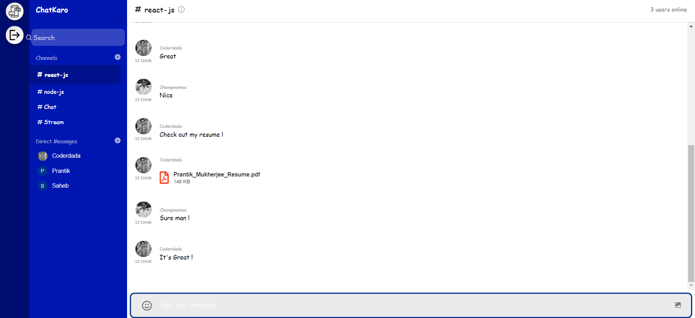
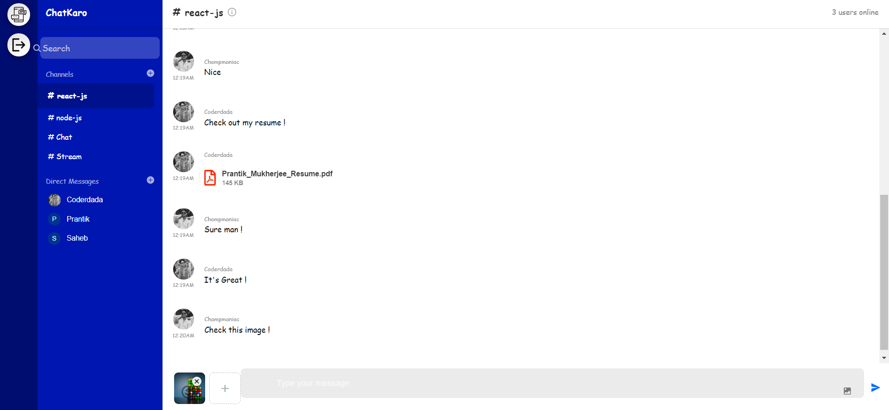
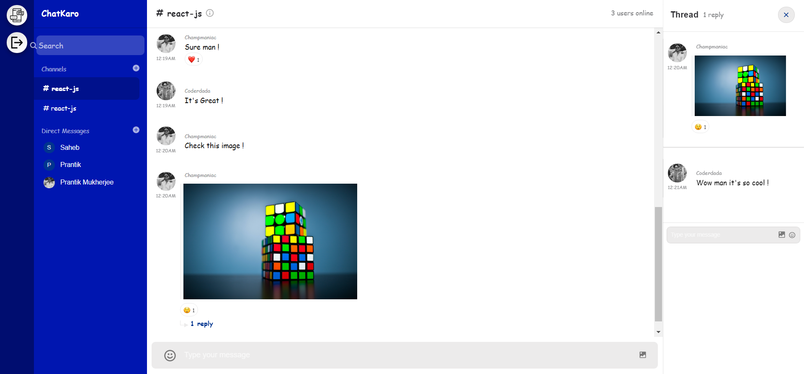

# ChatKaro [Live Here](https://champ-chatkaro.netlify.app/) -- (THIS IS NO LONGER IN WORKING STATE SINCE THE API HAS STOPPED THE SERVICES FOR MY ACCOUNT AFTER IT'S FREE TRIAL)
A Fully Responsive **Real-Time** Chat Application built using **React.js, Node.js, Express.js & GetStream.io** 
- A Full Stack messaging application with **User Authentication & SMS Notification** alert using **Twilio.** 
- Full Duplex Communication, with the use of **Stream-Chat** as the **API**, direct and group chats along  with the ability to edit & delete messages. 
# Signup

# Signin

# Chatting

# Sharing Files

# Sharing Images

